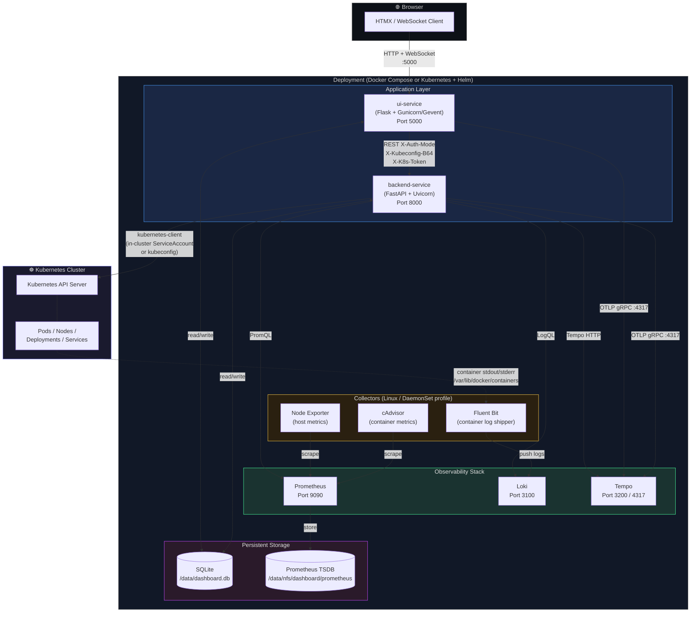

# Kubernetes Observability Dashboard

A self-hosted, full-stack Kubernetes observability platform with a split-service architecture. Manage clusters, stream logs, explore metrics, trace requests, and exec into pods — all from a single dark-themed browser UI.

| Service | Docker Compose URL | Kubernetes (port-forward) |
|---|---|---|
| Dashboard UI | http://localhost:5002 | http://localhost:5000 |
| Backend API (OpenAPI docs) | http://localhost:8001/docs | http://localhost:8000/docs |
| Prometheus | http://localhost:9090 | http://localhost:9090 |
| Loki | http://localhost:3100 | http://localhost:3100 |
| Tempo | http://localhost:3200 | http://localhost:3200 |

---

## Architecture



### Data Flows

| Flow | Path |
|---|---|
| **Page requests** | Browser → UI Service (Flask) → renders Jinja2 template |
| **Live updates** | Browser ← HTMX polling every 15 s via SSE / partial HTML |
| **Pod exec** | Browser ↔ WebSocket `/ws/pods/<ns>/<name>/exec` ↔ UI ↔ Backend ↔ K8s exec API |
| **K8s data** | Backend Service → `kubernetes-client` → Kubernetes API Server |
| **Metrics** | Backend Service → PromQL → Prometheus ← Node Exporter / cAdvisor |
| **Logs** | Backend Service → LogQL → Loki ← Fluent Bit ← container stdout |
| **Traces** | UI + Backend → OTLP gRPC → Tempo; Backend → Tempo HTTP API |
| **Auth state** | JWT from Google OAuth, validated in UI; kubeconfig stored in SQLite per user |
| **Credentials** | UI passes `X-Auth-Mode`, `X-Kubeconfig-B64`, `X-K8s-Token`, `X-K8s-Context` headers on every call to the Backend — keeping the backend fully stateless |

---

## Features

### Cluster Management
- Multi-context kubeconfig support — switch contexts in one click
- `incluster` mode for running inside Kubernetes (uses ServiceAccount token)
- Token-based auth (paste a bearer token + API server URL)
- Per-user kubeconfig stored encrypted in SQLite

### Workload Views
- **Nodes** — status, capacity, conditions, taints, events
- **Namespaces** — resource counts per namespace
- **Pods** — phase, restarts, resource usage, container statuses
- **Deployments** — replica sets, rollout status, YAML editor
- **Services / Ingresses / ConfigMaps / Secrets / PVCs / Jobs / CronJobs / StatefulSets / DaemonSets**
- Live auto-refresh every 15 s via HTMX (no page reload)
- Namespace filter on all resource tables
- Global search across pods, services, deployments

### Pod Operations
- Log viewer with INFO / WARN / ERROR colorization
- SSE live log tail (no polling, push-based)
- Loki historical log query with LogQL
- WebSocket interactive shell (`/ws/pods/<ns>/<name>/exec`)
- Delete pod with confirmation

### Observability
- Prometheus metrics with per-pod and per-node aggregation
- PromQL / LogQL ad-hoc query console
- Distributed trace exploration (Grafana Tempo / Jaeger)
- APM trace detail view
- RBAC matrix viewer — shows verb × resource permissions for the active account
- Query history (SQLite-backed)

### Platform
- Google OAuth 2.0 login with optional email allowlist
- Plugin system — drop a Python package into `ui-service/app/plugins/` to add nav items and routes
- SQLite shared between UI and Backend for events, metrics history, kubeconfigs, and users
- OpenTelemetry instrumentation on both services (OTLP gRPC → Tempo)
- Clean dark monospace theme (Tabler Icons, Chart.js, CodeMirror, HTMX — all vendored, no CDN)

---

## Quick Start (Docker Compose)

```bash
# 1. Clone and copy environment file
cp .env.example .env        # edit secrets (see Environment Variables below)

# 2. Start core stack
docker compose up -d

# 3. (Linux only) also start Fluent Bit, Node Exporter, cAdvisor
docker compose --profile linux up -d
```

Open http://localhost:5002, log in with Google OAuth, upload or paste a kubeconfig, and explore your cluster.

---

## Helm Deployment (Kubernetes)

The chart lives in [`helm/kube-dashboard/`](helm/kube-dashboard/) and deploys the full stack — UI, Backend, Loki, Prometheus, and Tempo — as Kubernetes workloads.

### Chart layout

```
helm/kube-dashboard/
├── Chart.yaml
├── values.yaml
└── templates/
    ├── _helpers.tpl
    ├── NOTES.txt
    ├── secret-app.yaml           # app secrets (SECRET_KEY, auth, OAuth)
    ├── secret-loki.yaml          # Loki S3 credentials
    ├── configmap-loki.yaml       # Loki config
    ├── configmap-prometheus.yaml # Prometheus scrape config
    ├── configmap-tempo.yaml      # Tempo config
    ├── pv-sqlite.yaml            # NFS PersistentVolume — SQLite data
    ├── pv-prometheus.yaml        # NFS PersistentVolume — Prometheus TSDB
    ├── pvc-sqlite.yaml           # PVC bound to NFS PV (shared by UI + Backend)
    ├── pvc-prometheus.yaml       # PVC bound to NFS PV
    ├── rbac-backend.yaml         # ServiceAccount + ClusterRole + ClusterRoleBinding
    ├── deployment-ui.yaml
    ├── service-ui.yaml
    ├── deployment-backend.yaml
    ├── service-backend.yaml
    ├── deployment-loki.yaml
    ├── service-loki.yaml
    ├── deployment-prometheus.yaml
    ├── service-prometheus.yaml
    ├── deployment-tempo.yaml
    ├── service-tempo.yaml
    └── ingress.yaml              # optional ingress for the UI
```

### Prerequisites

- Kubernetes cluster (1.25+)
- Helm 3.x (`brew install helm`)
- NFS server exporting `/data/nfs/dashboard` (readable/writable by the cluster nodes)

### NFS directory setup

Run these once on the NFS server:

```bash
mkdir -p /data/nfs/dashboard/sqlite
mkdir -p /data/nfs/dashboard/prometheus
chmod -R 777 /data/nfs/dashboard   # or restrict to the UID used by pods
```

Verify the NFS export is visible from a cluster node:

```bash
showmount -e <NFS_SERVER_IP>
# Expected output:
# /data/nfs/dashboard  *
```

### Install

```bash
helm install kube-dash ./helm/kube-dashboard \
  --namespace kube-dashboard \
  --create-namespace \
  --set nfs.server=<NFS_SERVER_IP> \
  --set secrets.secretKey="$(python3 -c 'import secrets; print(secrets.token_hex(32))')" \
  --set loki.s3.endpoint="http://<MINIO_OR_S3_ENDPOINT>" \
  --set loki.s3.bucket="loki" \
  --set loki.s3.accessKeyId="<KEY_ID>" \
  --set loki.s3.secretAccessKey="<SECRET_KEY>"
```

### Access the dashboard

```bash
kubectl port-forward -n kube-dashboard svc/kube-dash-kube-dashboard-ui 5000:5000
```

Then open http://localhost:5000.

### Upgrade

```bash
helm upgrade kube-dash ./helm/kube-dashboard \
  --namespace kube-dashboard \
  --reuse-values \
  --set uiService.image.tag=v1.2.0
```

### Uninstall

```bash
helm uninstall kube-dash --namespace kube-dashboard
# PVs are set to Retain — delete manually if desired:
kubectl delete pv kube-dash-kube-dashboard-sqlite kube-dash-kube-dashboard-prometheus
```

### Key values

| Key | Default | Description |
|---|---|---|
| `nfs.server` | `""` | **Required.** NFS server hostname or IP |
| `nfs.sqlitePath` | `/data/nfs/dashboard/sqlite` | NFS export path for SQLite data |
| `nfs.prometheusPath` | `/data/nfs/dashboard/prometheus` | NFS export path for Prometheus TSDB |
| `sqlite.persistence.size` | `1Gi` | SQLite PV capacity |
| `prometheus.persistence.size` | `10Gi` | Prometheus PV capacity |
| `prometheus.retention` | `15d` | Prometheus data retention period |
| `secrets.secretKey` | `dev-secret-change-me` | Flask `SECRET_KEY` — **change in production** |
| `secrets.authJwtSecret` | `""` | JWT secret for OAuth callbacks |
| `secrets.oauthRedirectUri` | `""` | Google OAuth redirect URI |
| `secrets.allowedEmails` | `""` | Comma-separated login allowlist |
| `loki.s3.*` | `""` | Loki S3 backend credentials |
| `loki.existingSecret` | `""` | Use a pre-created Loki S3 secret instead |
| `ingress.enabled` | `false` | Expose the UI via an Ingress resource |
| `ingress.host` | `kube-dashboard.local` | Ingress hostname |

Full reference: [`helm/kube-dashboard/values.yaml`](helm/kube-dashboard/values.yaml)

### Storage: NFS PersistentVolumes

Both PVs use `persistentVolumeReclaimPolicy: Retain` and static pre-binding via `claimRef`, so the PVC will only ever bind to the intended PV.

| Volume | NFS path | Access mode | Used by |
|---|---|---|---|
| `*-sqlite` | `/data/nfs/dashboard/sqlite` | `ReadWriteMany` | ui-service, backend-service |
| `*-prometheus` | `/data/nfs/dashboard/prometheus` | `ReadWriteMany` | prometheus |

> To use a dynamic NFS provisioner (e.g. `nfs-subdir-external-provisioner`) instead of static PVs, set `sqlite.persistence.storageClass` and `prometheus.persistence.storageClass` to your provisioner's StorageClass name. The static PV templates are skipped automatically when `storageClass` is non-empty.

### RBAC

The backend-service runs under a dedicated ServiceAccount with a ClusterRole that grants **read-only** (`get`, `list`, `watch`) access to pods, nodes, deployments, services, events, ingresses, jobs, configmaps, and the metrics API. No write permissions are granted except as needed for pod exec/delete via the UI.

---

## Environment Variables

All variables have safe defaults for local development. Copy `.env.example` to `.env` and fill in secrets before deploying.

### UI Service

| Variable | Default | Description |
|---|---|---|
| `SECRET_KEY` | `dev-secret-change-me` | Flask session secret — **change in production** |
| `AUTH_SERVICE_URL` | _(empty)_ | Redirect target for Google OAuth initiation |
| `AUTH_JWT_SECRET` | _(empty)_ | JWT secret for validating auth callbacks |
| `OAUTH_REDIRECT_URI` | `http://localhost:5002/auth/callback` | OAuth2 callback URL registered in Google Cloud |
| `SESSION_COOKIE_SECURE` | `0` | Set `1` behind HTTPS |
| `TRUST_PROXY_HEADERS` | `0` | Set `1` behind a reverse proxy (nginx, traefik) |
| `ALLOWED_EMAILS` | _(empty)_ | Comma-separated allowlist; empty = allow all authenticated users |
| `LOG_LEVEL` | `INFO` | Python log level |
| `LOKI_URL` | `http://loki:3100` | Loki push/query endpoint |
| `SQLITE_PATH` | `/data/dashboard.db` | SQLite database path (shared volume) |
| `DB_POLLER_ENABLED` | `1` | Enable background event/metric polling to SQLite |
| `EVENT_POLL_INTERVAL` | `30` | Seconds between Kubernetes event polls |
| `METRIC_POLL_INTERVAL` | `60` | Seconds between Prometheus metric polls |
| `BACKEND_SERVICE_URL` | `http://backend-service:8000` | Internal backend API base URL |
| `OTEL_EXPORTER_OTLP_ENDPOINT` | `http://tempo:4317` | OTLP gRPC endpoint for distributed tracing |

### Backend Service

| Variable | Default | Description |
|---|---|---|
| `LOG_LEVEL` | `INFO` | Python log level |
| `LOKI_URL` | `http://loki:3100` | Loki endpoint |
| `PROMETHEUS_URL` | `http://prometheus:9090` | Prometheus endpoint |
| `UI_ORIGIN` | `http://localhost:5002` | Allowed CORS origin |
| `SQLITE_PATH` | `/data/dashboard.db` | Shared SQLite path (same volume as UI) |
| `CLUSTER_SCOPE` | `local` | `local` (kubeconfig) or `incluster` (ServiceAccount) |
| `JAEGER_URL` | _(empty)_ | Jaeger query endpoint for traces |
| `TEMPO_URL` | `http://tempo:3200` | Grafana Tempo HTTP endpoint for traces |
| `OTEL_EXPORTER_OTLP_ENDPOINT` | `http://tempo:4317` | OTLP gRPC endpoint for distributed tracing |

### Loki (S3 backend)

Loki requires S3-compatible object storage. Set these variables to point at AWS S3, MinIO, or any S3-compatible service.

| Variable | Description |
|---|---|
| `LOKI_S3_ENDPOINT` | S3-compatible endpoint (e.g. MinIO, AWS S3) |
| `LOKI_S3_BUCKET` | Bucket name |
| `LOKI_S3_REGION` | Region (default `us-east-1`) |
| `LOKI_S3_ACCESS_KEY_ID` | Access key ID |
| `LOKI_S3_SECRET_ACCESS_KEY` | Secret access key |

---

## Google OAuth Setup

1. Create a **Web Application** OAuth 2.0 client in [Google Cloud Console](https://console.cloud.google.com/apis/credentials).
2. Add authorized redirect URI:
   - Local: `http://localhost:5002/auth/callback`
   - Kubernetes: `https://your-domain.com/auth/callback`
3. Set environment variables:

```bash
AUTH_SERVICE_URL="https://accounts.google.com/o/oauth2/v2/auth"
AUTH_JWT_SECRET="$(python3 -c 'import secrets; print(secrets.token_hex(32))')"
SECRET_KEY="$(python3 -c 'import secrets; print(secrets.token_hex(32))')"
ALLOWED_EMAILS="you@example.com,colleague@example.com"
```

---

## Backend API Reference

FastAPI auto-generates interactive docs at **http://localhost:8001/docs** (Docker Compose) or port-forward to `svc/*-backend:8000`.

| Router | Path prefix | Description |
|---|---|---|
| `clusters` | `/clusters` | List and switch kubeconfig contexts |
| `nodes` | `/nodes` | Node list and details |
| `pods` | `/pods` | Pod list, detail, exec, delete |
| `deployments` | `/deployments` | Deployment list and status |
| `events` | `/events` | Kubernetes events |
| `logs` | `/logs` | Loki log queries |
| `metrics` | `/metrics` | Prometheus metric queries |
| `traces` | `/traces` | Jaeger / Tempo trace queries |
| `rbac` | `/rbac` | RBAC matrix for the active service account |
| `query` | `/query` | Ad-hoc PromQL / LogQL pass-through |
| `resources` | `/resources` | Generic Kubernetes resource fetcher |
| `streaming` | `/streaming` | SSE log streaming |
| `raw` | `/raw` | Raw Kubernetes API proxy |

Prometheus scrape metrics are exposed at `/metrics` (standard `prometheus_client` format) and scraped by the bundled Prometheus instance.

---

## Plugin System

Drop a Python package into `ui-service/app/plugins/` that exports:

```python
# ui-service/app/plugins/myplugin/__init__.py
name = "My Plugin"
nav_label = "My Page"
nav_icon = "ti-star"
nav_url = "/myplugin"

def register(app):
    from flask import Blueprint, render_template
    bp = Blueprint("myplugin", __name__)

    @bp.route("/myplugin")
    def index():
        return render_template("myplugin/index.html")

    app.register_blueprint(bp)
```

The plugin loader picks it up automatically at startup; no core code changes needed.

---

## Docker Images

| Image | Description |
|---|---|
| `cherukuri1991/kube-dashboard-ui:latest` | Flask UI service (Gunicorn + Gevent) |
| `cherukuri1991/kube-dashboard-backend:latest` | FastAPI backend service (Uvicorn) |

Build locally:
```bash
docker compose build
```

Push to Docker Hub:
```bash
docker compose push
```

---

## Production Checklist

- [ ] Set `SECRET_KEY` to a strong random value (`python3 -c 'import secrets; print(secrets.token_hex(32))'`)
- [ ] Set `AUTH_JWT_SECRET` and configure Google OAuth redirect URI for your public hostname
- [ ] Set `ALLOWED_EMAILS` to restrict login access
- [ ] Set `SESSION_COOKIE_SECURE=1` and `TRUST_PROXY_HEADERS=1` behind an HTTPS reverse proxy or Ingress with TLS
- [ ] Configure Loki S3 backend (`LOKI_S3_*`) for durable log storage
- [ ] Set `OTEL_EXPORTER_OTLP_ENDPOINT` on both services for distributed tracing
- [ ] **Helm / Kubernetes only:**
  - [ ] Ensure NFS directories exist and are exported before `helm install`
  - [ ] Override `nfs.server` with your NFS server's IP or hostname
  - [ ] Set `ingress.enabled=true` and configure TLS if exposing externally
  - [ ] Review and tighten the ClusterRole rules in `values.yaml` → `backendService.rbac.rules`
  - [ ] Pin image tags (`uiService.image.tag`, `backendService.image.tag`) instead of using `latest`
- [ ] **Docker Compose only:**
  - [ ] Mount `./sqlite_data` and `./prometheus_data` to persistent volumes
  - [ ] Enable Linux profile for host/container metrics: `docker compose --profile linux up -d`

---

## Tech Stack

| Layer | Technology |
|---|---|
| UI framework | Flask 3 + Jinja2 + HTMX |
| UI server | Gunicorn + Gevent (concurrent SSE/WebSocket) |
| Backend framework | FastAPI + Uvicorn |
| Kubernetes client | `kubernetes-python` (k8s >= 29) |
| Metrics | Prometheus + `prometheus-fastapi-instrumentator` |
| Logs | Grafana Loki + Fluent Bit |
| Traces | Grafana Tempo + OpenTelemetry SDK (OTLP gRPC) |
| Auth | Google OAuth 2.0 + PyJWT |
| Storage | SQLite (NFS-backed PV in Kubernetes, bind-mounted volume in Docker Compose) |
| Frontend libs | Chart.js, CodeMirror, Tabler Icons (all vendored, no CDN) |
| Container runtime | Docker Compose (local) / Helm + Kubernetes (production) |
| Package manager | Helm 3 |
